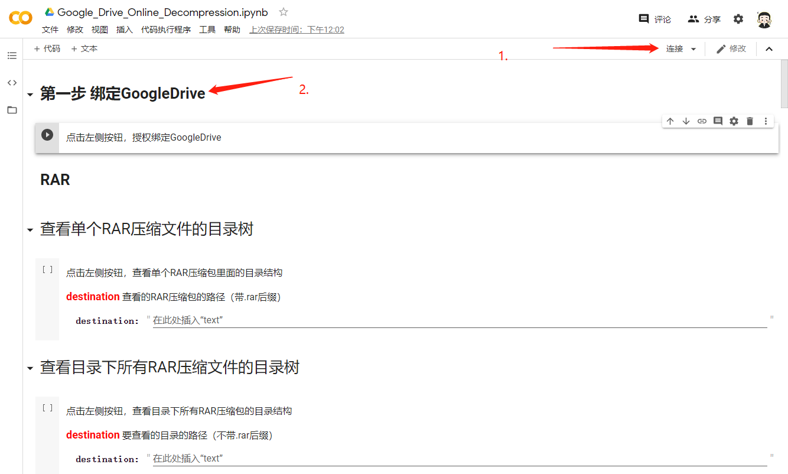

# Google-Drive-Online-Decompression V1.0
使用方法：

​		1.连接Google Colab登入Google账号 绑定Google Drive授权

​		

​		2.获取Google Drive 的信息

​	3.获取你要解压的文件（文件夹）路径

​		 直接复制路径即可

​	

​	4.按你的需求填入相对应的信息 ，然后运行即可。

注意事项：

​		1.如果因为魔法不行的 中途断流了 而导致解压关闭中断的。你直接重新运行即可，解压会自动覆盖写入。

